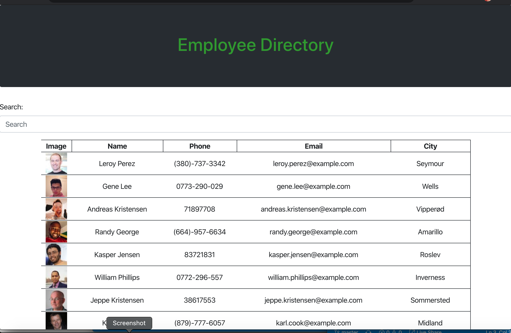

  # Employee-Directory
  


  

## Description 
 
  Using an api load a list of employees and their information into a table. using react. when the name title is clicked, it rearranges the list in order of the first name ascending, and then descending when clicked again. also you can filter within the search bar to find specific names

## Table of Contents 
 
- [Installation](#Installation) 

- [Usage](#Usage) 

- [License](#License) 

- [Contributing](#Contributing) 

- [Tests](#Tests) 

- [Questions](#Questions) 


## Installation  

```
npm install
```

## Usage 

nothing

## License 

This project is licensed under MIT license.

## Contributing 

undefined

## Tests 

```
npm test
```

## Questions 


If you have any questions, please contact adriana-didden directly at adrianadidden@gmail.com. 

